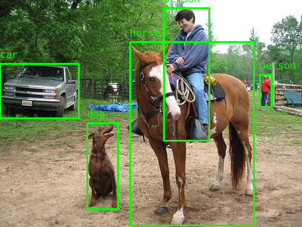
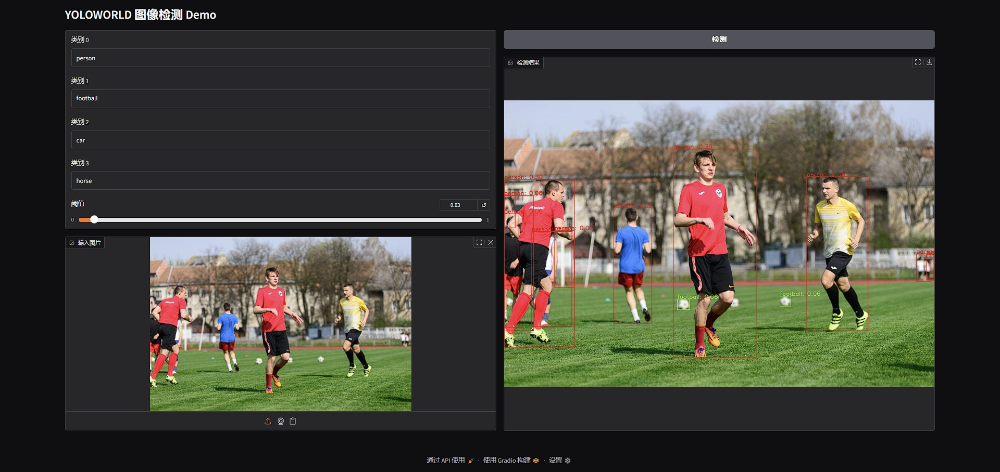

# YOLO World SDK for Axera NPU SoCs (AX650N / AX650A / AX8850N / AX8850)

---
## Build Instructions

### x86 Build

```bash
git clone https://github.com/AXERA-TECH/yoloworld.axera.git
cd yoloworld.axera
sudo apt install libopencv-dev build-essential 
./build.sh
```

### AArch64 Build

#### Cross-compile for aarch64

```bash
git clone https://github.com/AXERA-TECH/yoloworld.axera.git
cd yoloworld.axera
./build_aarch64.sh
```

#### Native Build on Target Board

```bash
git clone https://github.com/AXERA-TECH/yoloworld.axera.git
cd yoloworld.axera
sudo apt install libopencv-dev build-essential
./build.sh
```
---
## CI Status

| Architecture | Status |Download|
|--------------|--------|--------|
| x86          |  |[download](https://nightly.link/AXERA-TECH/yoloworld.axera/workflows/build/main/build-x86.zip) |
| aarch64      |  |[download](https://nightly.link/AXERA-TECH/yoloworld.axera/workflows/build/main/build-aarch64.zip) |

---
## Performance

YOLO-Worldv2-L

| Model | Input Shape |  Latency (ms) | CMM Usage (MB) |
|-------|------------|--------------|------------|
| [yolo_u16_ax650.axmodel](https://github.com/AXERA-TECH/yoloworld.axera/releases/download/v0.1/yolo_u16_ax650.axmodel) | 1 x 640 x 640 x 3 |  9.522 ms | 21 MB |
| [clip_b1_u16_ax650.axmodel](https://github.com/AXERA-TECH/yoloworld.axera/releases/download/v0.1/clip_b1_u16_ax650.axmodel) | 1 x 77 |  2.997 ms | 137 MB |
| [yolo_u16_ax630c.axmodel](https://github.com/AXERA-TECH/yoloworld.axera/releases/download/v0.1/yolo_u16_ax630c.axmodel) | 1 x 640 x 640 x 3 |  43.450 ms | 31 MB |
| [clip_b1_u16_ax630c.axmodel](https://github.com/AXERA-TECH/yoloworld.axera/releases/download/v0.1/clip_b1_u16_ax630c.axmodel) | 1 x 77 |  10.703 ms | 134 MB |
---

## Usage Example

### Get model

```bash
./test_detect_by_text --yoloworld yoloworld/yolo_u16_ax650.axmodel --tenc yoloworld/clip_b1_u16_ax650.axmodel -v yoloworld/vocab.txt -i ssd_horse.jpg --classes person,car,dog,horse
```



---

### Web demo(After `make install`)
```
pip install -r requirements.txt
python gradio_example.py --yoloworld yoloworld/yolo_u16_ax650.axmodel --tenc yoloworld/clip_b1_u16_ax650.axmodel --vocab yoloworld/vocab.txt

* Running on local URL:  http://0.0.0.0:7860
* To create a public link, set `share=True` in `launch()`.
```

---

## Community
QQ 群: 139953715
